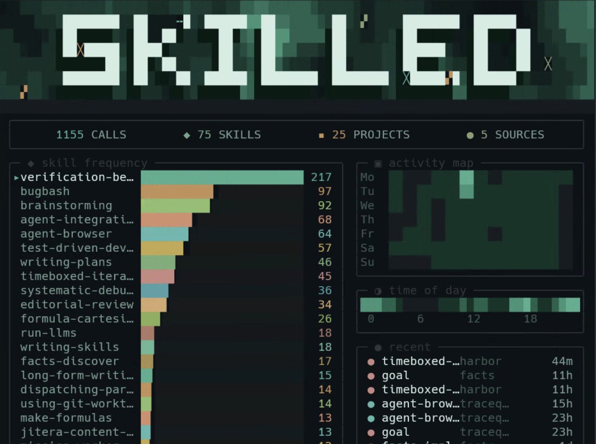

[](https://www.youtube.com/watch?v=Lmq8A9R49ZI)

[](https://github.com/av/skilled/releases)
[](https://www.npmjs.com/package/@avcodes/skilled)
[](https://pypi.org/project/skilled/)
[](https://github.com/av/skilled/blob/main/LICENSE)
[](https://github.com/av/skilled)

Your AI coding tools keep traces. Skilled reads them.

Live TUI dashboard that aggregates skill usage across Claude Code, OpenCode, Codex, Grok, and Droid. Reads local history files only. Zero network, zero telemetry.

## What you get

- 30 fps terminal dashboard: bar charts, 16-week activity heatmap, hourly histogram, recent activity feed
- Skill audit: heavy hitters, rising/declining trends, stale skills, one-offs, cross-project patterns
- CLI with JSON output: `skilled list`, `skilled audit`, `skilled detail <skill>`. Filter by source or project.

## Install

Shell (Linux / macOS):

```sh
curl -fsSL https://raw.githubusercontent.com/av/skilled/main/install.sh | sh
```

npm:

```sh
npm install -g @avcodes/skilled
```

pip:

```sh
pip install skilled
```

Then run `skilled`.

## Usage

```
skilled                          Interactive dashboard
skilled list                     All skills ranked by usage
skilled list --sort recent       Sorted by last used
skilled detail review            Deep dive on one skill
skilled audit                    Health report across all skills
skilled calls --source codex     Raw invocations from a specific tool
skilled providers                Which tools are detected
```

Add `--json` to any command for machine-readable output. Filter with `--source <tool>` and `--project <path>`.

### TUI keys

| Key | Action |
|-----|--------|
| `s` | Cycle sort: count → alphabetical → recent |
| `Tab` | Toggle sort direction |
| `j` / `k` | Scroll |
| `Enter` | Open skill detail (replaces right panel) |
| `a` | Toggle audit view |
| `r` | Refresh data |
| `q` / `Esc` | Quit |

## Supported tools

| Tool | What it reads |
|------|--------------|
| **Claude Code** | `~/.claude/history.jsonl` + session JSONL files |
| **OpenCode** | Local session history |
| **Codex** | Local session history |
| **Grok** | Local session history |
| **Droid** | Local session history |

Skilled auto-detects which tools are installed. No configuration needed. If the history files exist, they show up.

## How it works

Each tool writes session traces to predictable local paths. Skilled has a provider for each one that parses those files and extracts skill invocations (slash commands, tool calls, skill triggers) into a common format: skill name, timestamp, project, session, source.

From there: frequency counts, weekly trends, hourly distribution, per-project breakdowns, and audit heuristics (rising = 50%+ increase over 4 weeks, stale = unused 30+ days, etc.).

The TUI renders at 30 fps using [@opentui/core](https://github.com/nicholasgasior/opentui). Bar charts use 8-level Unicode block elements for sub-character precision. The heatmap uses a 5-level green intensity ramp.

No data leaves your machine. No accounts, no config files, no API keys.

## Build from source

Requires [Bun](https://bun.sh):

```sh
git clone https://github.com/av/skilled.git
cd skilled
bun install
bun run start
```

Compile to a standalone binary:

```sh
bun run build    # outputs ./skilled
```

### Optional: Rust index

For faster re-scanning of large history files:

```sh
cd index
cargo build --release
```

The TUI will use the index automatically when available.

## License

MIT
